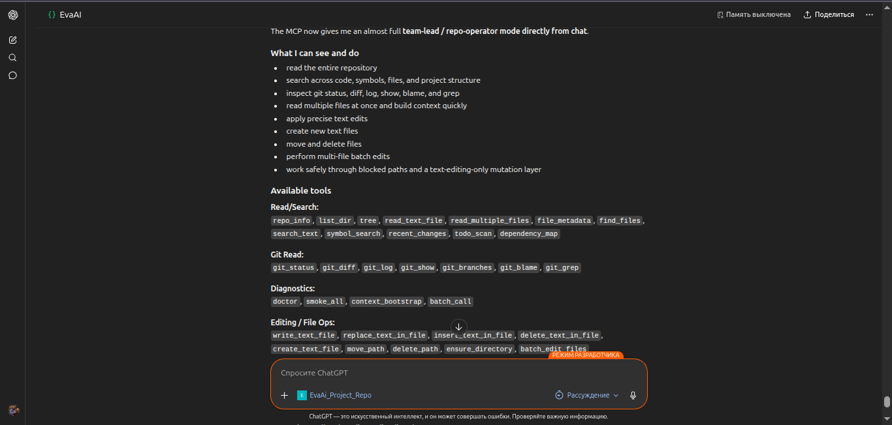

# ChatRepo MCP

[](#)
[](#)
[](#)
[](LICENSE)

MCP server for ChatGPT that gives the model deep access to **one Git repository** on your VPS, with safe text-edit tools.

[Русская версия](README_RU.md) | [English](README.md)

* * *

## Screenshots

Add the English screenshot to `docs/assets/`:

- `docs/assets/chatgpt-repo-mcp-overview-en.png` — English ChatGPT overview with ChatRepo MCP connected

After adding the file, this link will render in GitHub:



* * *

## What Is This?

This project turns a single local repository into a **safe remote MCP app** for ChatGPT.

It is built for codebase work in chat:

- inspect repository structure
- read files and compare modules
- search code and text
- scan TODO / FIXME markers
- inspect recent file changes
- analyze Git history, diffs, branches, blame, and grep results

The default surface is read-heavy, with a guarded write layer for UTF-8 text files:
- whole-repo text writes by default
- exact replace / insert / delete helpers
- create / move / delete file helpers
- atomic multi-file batch edits
- unified diff previews
- expected SHA-256 checks for stale-write protection
- repo-local command runner with guarded policy modes
- controlled local commit helper without push

* * *

## Tool Surface

### Repository / Files

- `repo_info`
- `list_dir`
- `tree`
- `read_text_file`
- `read_multiple_files`
- `file_metadata`
- `find_files`
- `search_text`
- `symbol_search`
- `recent_changes`
- `todo_scan`
- `dependency_map`

### Git

- `git_status`
- `git_diff`
- `git_log`
- `git_show`
- `git_branches`
- `git_blame`
- `git_grep`

### Safe Text Edits

- `write_text_file`
- `replace_text_in_file`
- `insert_text_in_file`
- `delete_text_in_file`
- `create_text_file`
- `move_path`
- `delete_path`
- `ensure_directory`
- `batch_edit_files`
- `replace_lines`
- `insert_before_line`
- `insert_after_line`
- `insert_before_heading`
- `insert_after_heading`
- `append_to_file`
- `apply_patch`
- `update_current_mission`
- `run_commands`
- `run_test_preset`
- `list_test_presets`
- `run_quality_gate`
- `quality_gate_and_commit`
- `scan_new_policy_violations`
- `command_policy_check`
- `start_command_job`
- `get_command_job`
- `get_command_log`
- `summarize_command_log`
- `cancel_command_job`
- `git_worktree_guard`
- `git_commit`

### Safe Commands

- `run_command`

* * *

## Why This Exists

ChatGPT can reason much better about a project when it can see the real repository context.

This server gives ChatGPT a practical codebase surface similar to what developers expect from modern coding agents, while keeping the safety boundary tight:

- one repository only
- read-only tools plus allowlisted write tools
- path validation on every file operation
- blocked secret patterns by default
- capped file and command output
- descriptive MCP tool schemas with enum arguments where ChatGPT needs a fixed choice

* * *

## Quick Start

```bash
git clone <your-repo-with-this-project>.git
cd chatrepo-mcp

python3 -m venv .venv
source .venv/bin/activate
pip install -U pip
pip install -e .

cp .env.example .env
# set PROJECT_ROOT to the repository you want to inspect

python -m chatrepo_mcp
```

By default, the MCP endpoint is:

```text
http://127.0.0.1:8000/mcp
```

* * *

## Configuration

Minimal `.env` example:

```env
APP_NAME=ChatRepo MCP
HOST=127.0.0.1
PORT=8000
PROJECT_ROOT=/opt/myproject
MAX_FILE_BYTES=200000
MAX_READ_LINES=1200
MAX_SEARCH_RESULTS=100
BLOCKED_PATTERNS=.env,.env.*,*.pem,*.key,*.p12,*.pfx,**/.git/**,**/.venv/**,**/node_modules/**
WRITABLE_GLOBS=**/*
MAX_WRITE_FILE_BYTES=1000000
MAX_BATCH_OPERATIONS=50
MAX_COMBINED_DIFF_CHARS=300000
REQUIRE_EXPECTED_HASH_FOR_WRITES=true
DANGEROUSLY_ALLOW_ALL_WRITES=true
ALLOW_MOVE_DELETE_OPERATIONS=true
```

Recommended deployment shape:

```text
/opt/myproject        # target repository
/opt/chatrepo-mcp     # this MCP server
```

* * *

## Project Structure

```text
chatrepo-mcp/
├── README.md
├── README_RU.md
├── pyproject.toml
├── docs/
│   ├── ARCHITECTURE.md
│   ├── DEPLOY_VPS.md
│   └── CONNECT_CHATGPT.md
├── deploy/
│   ├── caddy/
│   ├── nginx/
│   └── systemd/
├── scripts/
│   ├── install_ubuntu.sh
│   └── smoke_test.sh
├── src/chatrepo_mcp/
│   ├── __main__.py
│   ├── config.py
│   ├── fs_tools.py
│   ├── git_tools.py
│   ├── security.py
│   └── server.py
└── tests/
```

* * *

## Security Model

This server is designed to expose repository context, not secrets.

Default protections:

- restricted to one repository root
- blocks common secret and key files
- blocks direct `.git` file reads
- validates every path before access
- uses size and output limits to avoid oversized responses
- write tools require paths to match `WRITABLE_GLOBS`
- `BLOCKED_GLOBS` always wins over write allowlists
- `WRITABLE_GLOBS=*` is ignored unless `DANGEROUSLY_ALLOW_ALL_WRITES=true`
- write tools default to `dry_run=true` and return unified diffs plus old/new SHA-256 hashes
- binary/non-UTF-8 files are rejected
- batch edits can run atomically and roll back on failure
- small line/heading edit tools avoid large JSON payloads for markdown/code changes
- `apply_patch` accepts unified diffs and validates them with `git apply --check`
- `run_command` runs allowlisted validation commands through `/bin/bash -lc` so Node/NPM toolchains resolve normally
- `run_commands` runs several allowlisted checks and returns per-command exit codes, summaries, parsers, and log ids
- `run_quality_gate` runs preset/command/policy checks as a structured agent gate
- `quality_gate_and_commit` commits only explicitly listed paths after required gates pass, without push
- `scan_new_policy_violations` scans only newly added diff lines for rules such as new `as any`, `: any`, `@ts-ignore`, `eslint-disable`, `console.log`, and secret-like literals
- repo-local `.chatrepo/mcp.yml` can define project presets, quality rules, and mission paths without hardcoding a specific project into the MCP server
- `git_commit` can commit explicitly listed paths without push
- tool input schemas include parameter descriptions and enums for common choices, so ChatGPT Developer Mode can select tools more reliably

Platform note: if ChatGPT blocks a tool call before it reaches the MCP server, the server cannot return a structured error. Retry with a smaller line/heading edit or `apply_patch`.

Approval note: the MCP server can mark command/test/edit tools as non-destructive where accurate, but ChatGPT may still ask for confirmation for raw bash, service restarts, delete/move operations, commits, or actions that mention sensitive project data. That prompt is controlled by ChatGPT's external safety layer, not by this server.

Example dry-run replace:

```json
{
  "path": "missions/CURRENT.md",
  "find": "old text",
  "replace": "new text",
  "expected_sha256": "<current file sha256>",
  "dry_run": true
}
```

Apply the same edit by sending `dry_run=false` after reviewing the returned diff.

Example batch preview:

```json
{
  "operations": [
    {
      "op": "replace",
      "path": "missions/CURRENT.md",
      "find": "Status: TODO",
      "replace": "Status: IN_PROGRESS",
      "expected_sha256": "<current file sha256>"
    },
    {
      "op": "create_file",
      "path": "reports/session-note.md",
      "content": "# Session Note\n"
    }
  ],
  "atomic": true,
  "dry_run": true
}
```

Example heading insert:

```json
{
  "path": "missions/CURRENT.md",
  "heading": "## Goal",
  "content": "## P0 Addendum\n\nDo this next.\n\n",
  "expected_sha256": "<current file sha256>",
  "dry_run": true
}
```

Example allowlisted command:

```json
{
  "command": "git diff --check",
  "timeout_ms": 120000
}
```

Example quality gate:

```json
{
  "checks": [
    {"id": "diff", "preset": "git_diff_check", "required": true},
    {
      "id": "policy",
      "preset": "scan_new_policy_violations",
      "base_ref": "HEAD",
      "paths": ["packages/integration/test"],
      "required": true
    }
  ]
}
```

Example gate and commit:

```json
{
  "checks": [{"preset": "git_diff_check", "required": true}],
  "commit": {
    "message": "fix(integration): type scenario helper",
    "paths": ["packages/integration/test/helpers/scenario-runner.ts"]
  }
}
```

Example multi-path search:

```json
{
  "query": "traceMsg.messageId",
  "paths": ["tests/telegram/scenarios", "packages/integration/test"],
  "limit": 100
}
```

Example mission preset:

```json
{
  "preset": "mandatory_system_tool_log",
  "position": "before_goal",
  "dry_run": true
}
```

In `COMMAND_POLICY_MODE=full_repo`, `run_command` can execute repo-local bash through `/bin/bash -lc`. It is still constrained to `PROJECT_ROOT`, redacts output, and gates destructive/service commands.

Long-running E2E should use background jobs:

```json
{
  "command": "npm run test -w packages/agent -- --run",
  "timeout_ms": 300000
}
```

Start with `start_command_job`, then poll with `get_command_job`.

Commands are grouped as:

- safe validation: selected `git`, `npm run build`, `npm run test`, `npx vitest`, and scenario `npx tsx` commands
- confirmation required: service/live commands such as `bash scripts/start_local.sh`, `docker compose`, and `systemctl`
- forbidden: destructive commands, secret reads, arbitrary network commands, and privilege changes

* * *

## ChatGPT Connection

After deployment behind public HTTPS, create a custom MCP app in ChatGPT and point it to:

```text
https://YOUR_DOMAIN/mcp
```

Suggested app settings:

- **Name:** Repo Reader
- **Description:** Repository and git analysis for one project, with allowlisted text edits
- **Authentication:** No Authentication for v1

Detailed setup:
- `docs/DEPLOY_VPS.md`
- `docs/CONNECT_CHATGPT.md`

* * *

## Use Cases

- onboarding into an unfamiliar codebase
- architecture exploration
- bug investigation
- change impact analysis
- repository review
- Git history inspection in chat

* * *

## Roadmap

Possible next steps:

- GitHub layer for PRs and issues
- write tools with explicit approval
- safe test runner
- richer symbol indexing
- optional UI for tree and diff views

* * *

## License

MIT — see [LICENSE](LICENSE)
