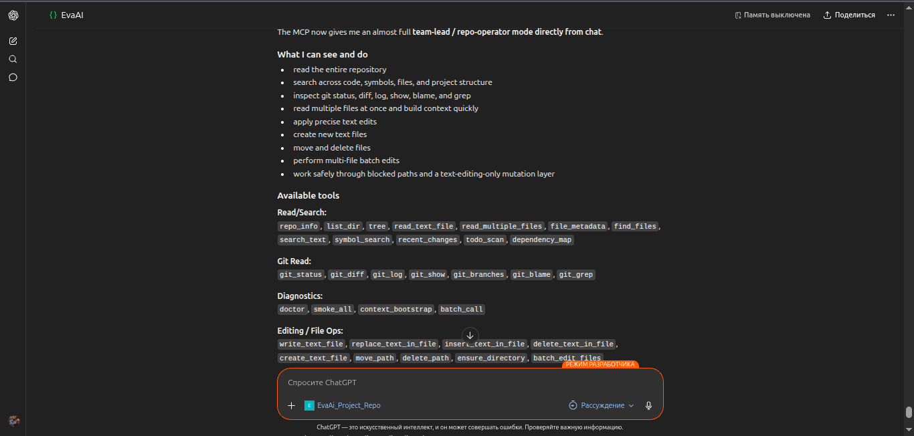

# ChatRepo MCP

[](python/)
[](go/)
[](contracts/tool-schemas/tools.json)
[](docs/INSTALL.md)
[](LICENSE)

Run it from a private Linux PC through OpenAI Secure MCP Tunnel, including
ChatGPT connection and reboot-safe systemd services: [full runbook](docs/OPENAI_SECURE_TUNNEL_RUNBOOK.md).

MCP server that turns **any folder or repository** into a working coding environment for an autonomous agent inside ChatGPT. Choose the Python package or the standalone Go binary; both share the same 96-tool capability catalog, configuration, and access semantics. Every tool publishes canonical input and additive output schemas, so MCP clients receive typed structured results without losing the existing JSON text representation. `ENABLE_PTY=true` is the default, so trusted POSIX deployments expose all 96 tools as soon as `ACCESS_MODE=full`; safe mode still exposes 90 tools without PTY.

[Русская версия](README_RU.md) | [English](README.md)

* * *

## Screenshots

Add a screenshot to `docs/assets/`:

- `docs/assets/chatgpt-repo-mcp-overview-en.png` — ChatGPT overview with ChatRepo MCP connected

After adding the file, this link will render in GitHub:



* * *

## What Is This?

ChatRepo MCP is a remote [MCP](https://modelcontextprotocol.io) server you run once (locally, on a VPS, or on your own PC behind a tunnel) and point ChatGPT's Developer Mode connector at. It gives the model a practical, coding-agent-grade surface over a workspace you choose: browsing and searching files, reading git history, making careful text edits with dry-run previews and hash checks, running your project's own commands (tests, linters, builds) through bash, driving the full git workflow (branches, stash, fetch/pull/push, merge, worktrees), opening and managing GitHub pull requests and CI runs via `gh`, and running one-shot diagnostics plus a symbol index for navigating code. It is **not tied to any specific project, language, or stack** — Go, Python, Node/TypeScript, Rust, or a mix of all of them in one polyrepo folder all work the same way, because the server autodetects what it's looking at instead of hardcoding commands.

* * *

## Quick Start

### 1. External dependencies

Required on the machine that runs the server:

- **Python 3.11+** for the Python implementation, or a downloaded **Go binary**
- **git**
- **[ripgrep](https://github.com/BurntSushi/ripgrep)** (the `rg` binary) — used by the search tools
- **bash** — built in on Linux/macOS; install Git Bash for the native Windows Go binary

Optional, enable extra tool groups (the server degrades gracefully and reports `missing_tools`/`install_hint` if these aren't installed — nothing fails to start without them):

- **[GitHub CLI](https://cli.github.com/) (`gh`)**, authenticated (`gh auth login`) — for the `gh_*` pull request / CI tools
- **[universal-ctags](https://github.com/universal-ctags/ctags)** (`ctags`) — for precise `symbol_definition` / `document_symbols` / `workspace_symbols`; without it these tools fall back to a regex-based heuristic
- Per-stack diagnostic tools you already use, e.g. `pyright` or `ruff` (Python), `go vet` (Go, ships with the Go toolchain), `tsc` via `npx` (TypeScript) — used by `code_diagnostics`

### 2. Install one implementation

Python package:

```bash
git clone <this-repo-url>.git chatrepo-mcp
cd chatrepo-mcp

python3 -m venv .venv
source .venv/bin/activate
pip install -U pip
pip install -e ./python
```

Go from source (prebuilt release archives use the same `chatrepo-mcp` command):

```bash
make build
```

See [Installation](docs/INSTALL.md) for release binaries, checksums, and platform notes.

### 3. Point it at your folder

```bash
cp .env.example .env
```

Edit `.env` and set `PROJECT_ROOT` to the absolute path of whatever you want the agent to work on:

```env
PROJECT_ROOT=/home/you/code/my-project
```

### 4. Run it

Python:

```bash
python -m chatrepo_mcp
```

Go:

```bash
./bin/chatrepo-mcp
```

The MCP endpoint is now:

```text
http://127.0.0.1:8000/mcp
```

Connect ChatGPT to it — see [Connecting to ChatGPT](#connecting-to-chatgpt) below, or the detailed walkthrough in [`docs/CONNECT_CHATGPT.md`](docs/CONNECT_CHATGPT.md).

* * *

## Pointing It at Your Own Folder

`PROJECT_ROOT` is the only thing you must set, and it can be:

- **A single repository** — `PROJECT_ROOT=/home/you/code/my-api` (a normal git repo, any stack).
- **A polyrepo workspace** — a parent folder that contains several independent git repositories side by side, e.g.:

  ```text
  /home/you/code/platform/
  ├── billing-service/     (Go, its own .git)
  ├── web-frontend/        (Node/TypeScript, its own .git)
  ├── data-pipeline/       (Python, its own .git)
  └── infra/               (no git, just config)
  ```

  Set `PROJECT_ROOT=/home/you/code/platform` and call the `list_repos` tool — it scans down `WORKSPACE_SCAN_DEPTH` levels (2 by default) and reports every repo it finds, along with its detected stack, branch, dirty state, and any Makefile targets. Every git tool and every command/preset tool then accepts an optional `repo="billing-service"` (or a `cwd`) argument to target that sub-repository specifically.
- **A plain folder with no git at all** — read/search/edit tools still work; git-specific tools report there's no repository instead of failing.

`list_repos` is the natural first call for the agent in a new workspace: it's the discovery entry point.

* * *

## The Perimeter (and How to Open It Up)

By default the agent lives strictly inside `PROJECT_ROOT`: it can `cd`/read/write/run anywhere below that folder, but never above it or outside it. Three settings control how wide that perimeter is:

| Setting | Default | Effect |
|---|---|---|
| `PROJECT_ROOT` | *(required)* | The workspace root. Every relative path the agent uses is resolved against this. |
| `WORKSPACE_ROOTS` | *(empty)* | Comma-separated **extra** absolute folders to allow alongside `PROJECT_ROOT` — e.g. a shared library that lives outside your main project folder. |
| `FILESYSTEM_UNRESTRICTED` | `false` | When `true`, removes the perimeter completely: the agent can read/write/run anywhere on the machine the server process can reach. |

Structured file/edit/index tools keep `SECRET_GLOBS` blocked unless both `ACCESS_MODE=full` and `ALLOW_SECRET_ACCESS=true` are set. In full mode, the raw shell is intentionally unrestricted and therefore can access anything the server's OS user can access.

Example: give the agent access to a folder next to your main project too:

```env
PROJECT_ROOT=/home/you/code/my-api
WORKSPACE_ROOTS=/home/you/code/shared-protos
```

* * *

## Access and Command Policy Modes

`ACCESS_MODE=safe` is the default. It keeps the filesystem scoped, uses allowlisted commands by default, previews writes, requires stale-write hashes, and retains internal confirmation gates. `ACCESS_MODE=full` is the explicit trusted-machine switch: unrestricted shell/filesystem, actual writes by default, move/delete enabled, and no internal `confirmed` prompts. `ALLOW_SECRET_ACCESS`, `ALLOW_FORCE_PUSH`, and `ALLOW_HARD_RESET` remain separate structural-tool interlocks.

`run_command` (and everything built on it: `run_test_preset`, `run_quality_gate`, background jobs) is a real `bash -lc` shell, gated by `COMMAND_POLICY_MODE`:

| Mode | Behavior | When to use it |
|---|---|---|
| `allowlist` | Strictest. Only a small built-in list of read-only commands (plus anything you add via `.chatrepo/mcp.yml`) is allowed. Shell operators (`&&`, `\|`, `;`, ...) are rejected outright. | A shared/public-facing deployment where you want a hard cap on what can run. |
| `guarded` | Full bash is available. Commands matching `DESTRUCTIVE_WORDS` require `confirmed=true`; `DENIED_WORDS` is blocked. | An intermediate safe-mode policy. |
| `unrestricted` | No command-policy checks. Forced by `ACCESS_MODE=full`. | A fully trusted machine/account. |

Safe mode blocks raw `git push` and routes it through the audited `git_push` tool. Full mode deliberately exposes raw bash, so raw push and other shell operations are possible; use a dedicated OS account and repository permissions as the real boundary.

**Important:** ChatGPT's four action-permission levels are a separate client-side layer. To avoid web prompts, select **Allow all actions** for this app. The server keeps truthful MCP annotations; `ACCESS_MODE=full` only removes server-side previews/confirmation gates.

* * *

## Stack Autodetection and Test Presets

Instead of hardcoding `npm test` or `pytest` for one project, the server looks at what's actually in a folder and resolves the right command for it:

- `go.mod` → Go (`go test ./...`, `go vet ./...`, `go build ./...`, `gofmt -l .`)
- `pyproject.toml` / `setup.py` / `requirements.txt` / `Pipfile` → Python (`pytest -x -q`, `ruff check .`, `mypy .`, `ruff format --check .`)
- `package.json` (+ `tsconfig.json`) → Node/TypeScript (`npm test`, `npm run lint --if-present`, `npx tsc --noEmit`, `npm run build --if-present`)
- `Cargo.toml` → Rust (`cargo test`, `cargo clippy`, `cargo build`, `cargo fmt --check`)
- A `Makefile` target with a matching name (`test`, `lint`, `typecheck`, `format`, `build`) always wins over the stack default, since it usually encapsulates project-specific flags.

Call `run_test_preset("test")` at the workspace root, or `run_test_preset("test", cwd="billing-service")` / the equivalent composite form `run_test_preset("billing-service:test")` for a specific sub-repo in a polyrepo workspace. Use `list_test_presets` (optionally with `path=`) to see what actions are available and what command each one resolves to before running it.

* * *

## Tool Groups

Both implementations share a 96-tool catalog. Safe mode registers 90 tools; full mode registers all 96 on Linux/macOS because PTY is enabled by default. Call `doctor` (or `smoke_all`) for the registered count, effective PATH, tool versions, and feature capabilities. Groups:

- **Read / search** — `repo_info`, `list_dir`, `tree`, `read_text_file`, `read_multiple_files`, `file_metadata`, `find_files`, `search_text`, `symbol_search`, `recent_changes`, `todo_scan`, `dependency_map`, `list_repos`. `search_text` defaults to bounded `quick` mode; `mode=exhaustive` starts a durable background search that is polled and cancelled through the existing job tools.
- **Git (read-only)** — `git_status`, `git_diff`, `git_log`, `git_show`, `git_branches`, `git_blame`, `git_grep` — all accept an optional `repo=` for polyrepo workspaces.
- **Editing** — `write_text_file`, `replace_text_in_file`, `insert_text_in_file`, `delete_text_in_file`, `create_text_file`, `move_path`, `delete_path`, `ensure_directory`, `batch_edit_files`, `apply_change_set`, `replace_lines`, `insert_before_line` / `insert_after_line`, `insert_before_heading` / `insert_after_heading`, `append_to_file`, `apply_patch`. Omitted `dry_run` previews in safe mode and applies in full mode; explicit `dry_run=true` always previews.
- **Commands / tests / jobs** — `run_command`, `run_commands`, `run_test_preset`, `list_test_presets`, `run_quality_gate`, `quality_gate_and_commit`, `scan_new_policy_violations`, `command_policy_check`, `start_command_job` / `list_command_jobs` / `get_command_job` / `get_job_status` / `get_command_log` / `summarize_command_log` / `cancel_command_job`, `read_artifact`, `git_worktree_guard`, `git_commit`.
- **Persistent terminal** (gated) — `start_terminal_session`, `read_terminal_session`, `write_terminal_session`, `resize_terminal_session`, `close_terminal_session`, `list_terminal_sessions`.
- **Git workflow** — `git_switch_branch`, `git_create_branch`, `git_add`, `git_restore`, `git_stash`, `git_fetch`, `git_pull`, `git_push`, `git_merge`, `git_revert`, `git_reset`, `git_worktree_add` / `prepare_task_worktree` / `git_worktree_list` / `git_worktree_remove`. Safe mode previews/gates risky operations; full mode executes without internal confirmation. Structured force push and hard reset still require `ALLOW_FORCE_PUSH=true` / `ALLOW_HARD_RESET=true`.
- **GitHub** (needs `gh` installed and authenticated) — `gh_status`, `gh_pr_create`, `gh_pr_list`, `gh_pr_view`, `gh_pr_comment`, `gh_pr_merge`, `gh_checks`, `gh_run_view`, `gh_run_rerun`, `gh_issue_list`, `gh_issue_view`.
- **Diagnostics & symbols** — `code_diagnostics` (runs `go vet` / `pyright` (or `ruff`) / `tsc --noEmit` depending on the detected stack), `symbol_definition`, `document_symbols`, `workspace_symbols` (via `ctags` when installed, otherwise a regex heuristic, always labeled with `engine`).
- **Self-check** — `doctor`, `smoke_all`, `context_bootstrap`, `batch_call`.

`batch_call` executes safe reads/previews in parallel by default (`max_concurrency=4`) while preserving result order; use `execution="sequential"` when ordering matters. Its worker concurrency is independent of the heavy-operation capacity: each heavy child still acquires the shared lease and fails fast with `resource_busy` when that capacity is full. Test presets automatically attach to an identical running background job instead of duplicating it. Persistent terminals are raw trusted-machine shells: they appear only in full mode, and can be removed explicitly with `ENABLE_PTY=false`.

Potentially large outputs are streamed through redaction before they are retained. Command, Git, and GitHub responses use a 64 KiB head/tail inline preview by default (`DEFAULT_INLINE_OUTPUT_BYTES`); this does not reduce the hard capture ceilings or the complete artifact. When the complete redacted output is durable, the result includes a ready `continuation` for `read_artifact`. Its cursor is opaque: pass it back unchanged until `eof=true`. Artifacts expire automatically and are subject to the configured per-artifact, total-store, and free-disk reserves.

* * *

## Configuring Your Own Stack via `.chatrepo/mcp.yml`

Drop a `.chatrepo/mcp.yml` file at the root of the target folder (or any sub-repo in a polyrepo workspace) to extend the defaults without changing the server itself:

```yaml
presets:
  # A named preset with an explicit command; picked up by run_test_preset("integration")
  integration:
    command: "make integration-test"
    parser: auto
    cwd: services/api          # optional: scope this preset to one sub-repo

quality_rules:
  - no_secret_like_literals
  - no_new_console_log

mission:
  current: docs/CURRENT_TASK.md

allowed_commands:
  # Only consulted in COMMAND_POLICY_MODE=allowlist
  - "make lint"
  - command: "npx vitest run"
    allow_suffix: true

confirmation_commands:
  - "docker compose"
```

- `presets` — named commands resolved by `run_test_preset`/`list_test_presets`; they take priority over autodetected/Makefile presets for the same action name.
- `quality_rules` — rule ids used by `scan_new_policy_violations`/`run_quality_gate` when scanning newly added diff lines (secret-like literals, `console.log`, `: any`, `print(...)`, etc. — see `workflows.RULE_PATTERNS` for the full list).
- `mission` — optional context files `context_bootstrap`/`doctor` will look for (all optional; missing files are reported, not treated as errors).
- `allowed_commands` / `confirmation_commands` — extend the built-in `allowlist`-mode command list.
- Full nested YAML needs `pip install pyyaml` (optional dependency); without it, a minimal built-in parser handles simple two-level structures like the example above.
- `COMMAND_SHELL_PRELUDE` (e.g. to source `nvm`/`pyenv`/a virtualenv before running commands) is a server-wide **environment variable**, not an `mcp.yml` key — set it in `.env`.

* * *

## Connecting to ChatGPT

1. For a local/private server, create an [OpenAI Secure MCP Tunnel](https://platform.openai.com/settings/organization/tunnels), create its runtime key on the [API keys page](https://platform.openai.com/settings/organization/api-keys), and run `tunnel-client` locally.
2. Open <https://chatgpt.com/plugins>, press **+**, choose **Tunnel**, and select the tunnel. Use **No Authentication** when the MCP listener stays on loopback behind that tunnel.
3. For a public URL instead, choose **Server URL** and configure OAuth or another authentication method supported by the ChatGPT dialog; do not expose a full agent anonymously.
4. For no ChatGPT-side prompts, set the app to **Allow all actions**; independently set `ACCESS_MODE=full` on this server.

Full walkthrough, including first prompts to try: [`docs/CONNECT_CHATGPT.md`](docs/CONNECT_CHATGPT.md).

* * *

## Security

- **Secret access is explicit.** Structured tools require `ACCESS_MODE=full` plus `ALLOW_SECRET_ACCESS=true`; raw full-mode shell follows OS permissions.
- **Command output is redacted.** Tokens, passwords, API keys, bearer headers, private-key blocks, and credential-bearing URLs are stripped from command stdout/stderr before it's returned or logged.
- **Every command is audited.** `run_command`/`run_commands`/background jobs/`git_push` append a structured JSON line (with secrets redacted) to `COMMAND_AUDIT_LOG_PATH` (default `~/.local/state/chatrepo-mcp/commands.log`).
- **Writes are mode-aware.** Safe mode keeps glob/hash/dry-run protection. Full mode applies writes immediately unless the caller explicitly asks for a preview.
- **Full means real shell access.** It is bounded by the Unix/Windows account running the service, not by a pretend command sandbox.
- **Match auth to transport.** Secure MCP Tunnel uses a separate runtime API key in `tunnel-client`, while the loopback MCP server can remain `MCP_AUTH_MODE=none`. Public URL deployments need OAuth or another ChatGPT-supported authentication layer. Static bearer mode is for clients that can send the header directly.

* * *

## Use Cases

Works the same way regardless of what's in the folder:

- Onboarding into an unfamiliar codebase, single repo or polyrepo
- Bug investigation across services in different languages
- Making a small fix end to end: branch → edit → test → commit → push → open a PR → watch CI
- Reviewing a pull request and replying to review comments
- Architecture/dependency exploration and TODO/FIXME sweeps

* * *

## Project Structure

```text
chatrepo-mcp/
├── README.md
├── README_RU.md
├── .env.example
├── VERSION
├── Makefile
├── python/
│   ├── pyproject.toml
│   ├── src/chatrepo_mcp/
│   └── tests/
├── go/
│   ├── go.mod
│   ├── cmd/chatrepo-mcp/
│   └── internal/
├── contracts/
│   ├── tool-schemas/
│   └── acceptance/
├── docs/
│   ├── ARCHITECTURE.md
│   ├── DEPLOY_VPS.md
│   ├── CONNECT_CHATGPT.md
│   ├── EXPOSE_LOCAL_PC.md
│   └── VPS_LOCAL_RUNBOOK.md
├── deploy/
│   ├── caddy/
│   ├── nginx/
│   └── systemd/
└── scripts/
```

* * *

## License

MIT — see [LICENSE](LICENSE)
