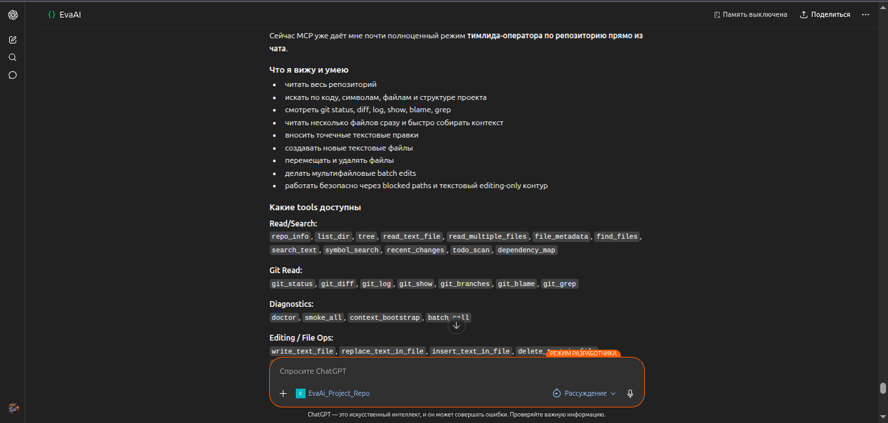

# ChatRepo MCP

[](#)
[](#)
[](#)
[](LICENSE)

MCP сервер для ChatGPT, который даёт модели глубокий доступ к **одному Git-репозиторию** на вашем VPS и умеет безопасно редактировать текстовые файлы.

[Русская версия](README_RU.md) | [English](README.md)

* * *

## Скриншоты

Добавьте русский скриншот в `docs/assets/`:

- `docs/assets/chatgpt-repo-mcp-overview-ru.png` — скрин ChatGPT на русском с подключённым ChatRepo MCP

После добавления файла эта ссылка отрендерится на GitHub:



* * *

## Что это

Этот проект превращает одну локальную репу в **безопасное remote MCP-приложение** для ChatGPT.

Он нужен для работы с кодовой базой прямо в чате:

- смотреть структуру репозитория
- читать файлы и сравнивать модули
- искать код и текст
- находить TODO / FIXME
- смотреть недавние изменения файлов
- анализировать Git-историю, diff, ветки, blame и grep

Основной режим — чтение и анализ, плюс защищённый слой редактирования UTF-8 файлов:
- запись текстовых файлов по policy
- точечные replace / insert / delete
- создание / перемещение / удаление файлов
- atomic batch edits
- diff preview и SHA-256 защита от stale writes
- repo-local command runner с защищёнными policy modes
- controlled local commit helper без push

* * *

## Набор инструментов

### Репозиторий / файлы

- `repo_info`
- `list_dir`
- `tree`
- `read_text_file`
- `read_multiple_files`
- `file_metadata`
- `find_files`
- `search_text`
- `symbol_search`
- `recent_changes`
- `todo_scan`
- `dependency_map`

### Git

- `git_status`
- `git_diff`
- `git_log`
- `git_show`
- `git_branches`
- `git_blame`
- `git_grep`

### Безопасное редактирование

- `write_text_file`
- `replace_text_in_file`
- `insert_text_in_file`
- `delete_text_in_file`
- `create_text_file`
- `move_path`
- `delete_path`
- `ensure_directory`
- `batch_edit_files`
- `apply_change_set`
- `replace_lines`
- `insert_before_line`
- `insert_after_line`
- `insert_before_heading`
- `insert_after_heading`
- `append_to_file`
- `apply_patch`
- `update_current_mission`
- `run_commands`
- `run_test_preset`
- `list_test_presets`
- `run_quality_gate`
- `quality_gate_and_commit`
- `scan_new_policy_violations`
- `command_policy_check`
- `start_command_job`
- `get_command_job`
- `get_job_status`
- `get_command_log`
- `summarize_command_log`
- `cancel_command_job`
- `git_worktree_guard`
- `git_commit`

### Безопасные команды

- `run_command`

* * *

## Зачем это нужно

ChatGPT гораздо лучше понимает проект, когда видит реальный контекст репозитория.

Этот сервер даёт сильный набор возможностей для анализа кодовой базы в чате и при этом держит безопасные границы:

- только одна репа
- read-only тулзы плюс write tools для текстовых файлов
- валидация пути на каждой файловой операции
- блокировка секретов по шаблонам
- лимиты на размер чтения и объём вывода
- подробные MCP tool schemas с enum-аргументами там, где ChatGPT нужен фиксированный выбор

* * *

## Быстрый старт

```bash
git clone <your-repo-with-this-project>.git
cd chatrepo-mcp

python3 -m venv .venv
source .venv/bin/activate
pip install -U pip
pip install -e .

cp .env.example .env
# укажите PROJECT_ROOT на репозиторий, который нужно анализировать

python -m chatrepo_mcp
```

По умолчанию MCP endpoint будет доступен по адресу:

```text
http://127.0.0.1:8000/mcp
```

* * *

## Конфигурация

Минимальный пример `.env`:

```env
APP_NAME=ChatRepo MCP
HOST=127.0.0.1
PORT=8000
PROJECT_ROOT=/opt/myproject
MAX_FILE_BYTES=200000
MAX_READ_LINES=1200
MAX_SEARCH_RESULTS=100
BLOCKED_PATTERNS=.env,.env.*,*.pem,*.key,*.p12,*.pfx,**/.git/**,**/.venv/**,**/node_modules/**
WRITABLE_GLOBS=**/*
MAX_WRITE_FILE_BYTES=1000000
MAX_BATCH_OPERATIONS=50
MAX_COMBINED_DIFF_CHARS=300000
REQUIRE_EXPECTED_HASH_FOR_WRITES=true
DANGEROUSLY_ALLOW_ALL_WRITES=true
ALLOW_MOVE_DELETE_OPERATIONS=true
```

Рекомендуемая схема размещения:

```text
/opt/myproject        # целевая репа
/opt/chatrepo-mcp     # этот MCP сервер
```

* * *

## Структура проекта

```text
chatrepo-mcp/
├── README.md
├── README_PUBLIC_EN.md
├── README_PUBLIC_RU.md
├── pyproject.toml
├── docs/
│   ├── ARCHITECTURE.md
│   ├── DEPLOY_VPS.md
│   └── CONNECT_CHATGPT.md
├── deploy/
│   ├── caddy/
│   ├── nginx/
│   └── systemd/
├── scripts/
│   ├── install_ubuntu.sh
│   └── smoke_test.sh
├── src/chatrepo_mcp/
│   ├── __main__.py
│   ├── config.py
│   ├── fs_tools.py
│   ├── git_tools.py
│   ├── security.py
│   └── server.py
└── tests/
```

* * *

## Модель безопасности

Этот сервер предназначен для доступа к контексту репозитория, а не к секретам.

Защита по умолчанию:

- работа только внутри одного корня репозитория
- блокировка типовых секретов и ключей
- запрет прямого чтения `.git`
- проверка каждого пути перед доступом
- лимиты на размер файлов и вывода
- `BLOCKED_GLOBS` сильнее write allowlist
- бинарные и non-UTF-8 файлы не редактируются
- write tools по умолчанию делают `dry_run=true`
- batch edits могут выполняться атомарно с rollback
- `apply_change_set` даёт agent-friendly multi-file edit wrapper со structured examples для invalid requests
- line/heading edit tools уменьшают payload для markdown/code правок
- `apply_patch` принимает unified diff и проверяет его через `git apply --check`
- `run_command` запускает allowlisted проверки через `/bin/bash -lc`, чтобы нормально резолвились Node/NPM toolchains
- `run_commands` запускает несколько allowlisted проверок и возвращает exit code, summary, parsed output и log id по каждой команде
- `run_quality_gate` запускает preset/command/policy checks как структурированный agent gate
- `quality_gate_and_commit` коммитит только явно перечисленные paths после зелёных required gates, без push
- background jobs поддерживают `concurrency_key` locks, conflict attach/fail/wait, status polling, cancel и timeout cleanup process group
- `scan_new_policy_violations` сканирует только новые строки diff на новые `as any`, `: any`, `@ts-ignore`, `eslint-disable`, `console.log` и secret-like literals
- repo-local `.chatrepo/mcp.yml` задаёт presets, quality rules и mission paths без зашивания конкретного проекта в MCP сервер
- `git_commit` может сделать commit только явно перечисленных путей, без push
- input schemas содержат описания параметров и enum'ы для типовых выборов, чтобы ChatGPT Developer Mode надёжнее выбирал нужный tool

Важно: если ChatGPT заблокировал tool call до отправки на MCP, сервер не может вернуть structured error. Повторите меньшим line/heading edit или через `apply_patch`.

Важно про подтверждения: MCP сервер может помечать command/test/edit tools как non-destructive там, где это честно, но ChatGPT всё равно может спросить подтверждение на raw bash, restart сервисов, delete/move, commit или действия, где всплывают sensitive данные проекта. Это внешний safety layer ChatGPT, а не настройка внутри этого сервера.

Пример вставки перед заголовком:

```json
{
  "path": "missions/CURRENT.md",
  "heading": "## Goal",
  "content": "## P0 Addendum\n\nDo this next.\n\n",
  "expected_sha256": "<current file sha256>",
  "dry_run": true
}
```

Пример allowlisted команды:

```json
{
  "command": "git diff --check",
  "timeout_ms": 120000
}
```

Пример change-set preview:

```json
{
  "name": "two-file-doc-edit",
  "operations": [
    {
      "op": "replace",
      "path": "docs/a.md",
      "find": "old",
      "replace": "new",
      "expected_sha256": "<sha256>"
    },
    {
      "op": "insert_before_heading",
      "path": "docs/b.md",
      "heading": "## Notes",
      "content": "New note\n",
      "expected_sha256": "<sha256>"
    }
  ],
  "atomic": true,
  "dry_run": true
}
```

Пример quality gate:

```json
{
  "checks": [
    {"id": "diff", "preset": "git_diff_check", "required": true},
    {
      "id": "policy",
      "preset": "scan_new_policy_violations",
      "base_ref": "HEAD",
      "paths": ["packages/integration/test"],
      "required": true
    }
  ]
}
```

Пример gate and commit:

```json
{
  "checks": [{"preset": "git_diff_check", "required": true}],
  "commit": {
    "message": "fix(integration): type scenario helper",
    "paths": ["packages/integration/test/helpers/scenario-runner.ts"]
  }
}
```

Пример multi-path search:

```json
{
  "query": "traceMsg.messageId",
  "paths": ["tests/telegram/scenarios", "packages/integration/test"],
  "limit": 100
}
```

Пример mission preset без большого payload:

```json
{
  "preset": "mandatory_system_tool_log",
  "position": "before_goal",
  "dry_run": true
}
```

В режиме `COMMAND_POLICY_MODE=full_repo` `run_command` может выполнять repo-local bash через `/bin/bash -lc`. Он всё равно ограничен `PROJECT_ROOT`, редактирует секреты в выводе и требует подтверждение для destructive/service команд.

Долгие E2E лучше запускать background job:

```json
{
  "command": "npm run test -w packages/agent -- --run",
  "timeout_ms": 300000
}
```

Старт через `start_command_job`, потом polling через `get_command_job` или `get_job_status`.

Для live suites используйте lock:

```json
{
  "command": "npm run test:live -w packages/integration",
  "concurrency_key": "telegram-live-e2e",
  "on_conflict": "attach",
  "timeout_ms": 300000
}
```

Команды делятся так:

- safe validation: выбранные `git`, `npm run build`, `npm run test`, `npx vitest` и scenario `npx tsx`
- confirmation required: service/live команды вроде `bash scripts/start_local.sh`, `docker compose`, `systemctl`
- forbidden: destructive команды, чтение секретов, произвольная сеть и повышение прав

* * *

## Подключение к ChatGPT

После деплоя за публичным HTTPS создайте кастомное MCP-приложение в ChatGPT и укажите:

```text
https://YOUR_DOMAIN/mcp
```

Рекомендуемые настройки приложения:

- **Название:** Repo Reader
- **Описание:** Repository and git analysis with safe text edits for one project
- **Аутентификация:** Без авторизации для v1

Подробные инструкции:
- `docs/DEPLOY_VPS.md`
- `docs/CONNECT_CHATGPT.md`

* * *

## Где это полезно

- онбординг в чужой кодовой базе
- обзор архитектуры проекта
- расследование багов
- анализ влияния изменений
- ревью репозитория
- изучение Git-истории в чате

* * *

## Дальше можно добавить

- GitHub слой для PR и issues
- безопасный запуск тестов
- более умный symbol indexing
- optional UI для дерева и diff

* * *

## Лицензия

MIT — см. [LICENSE](LICENSE)
