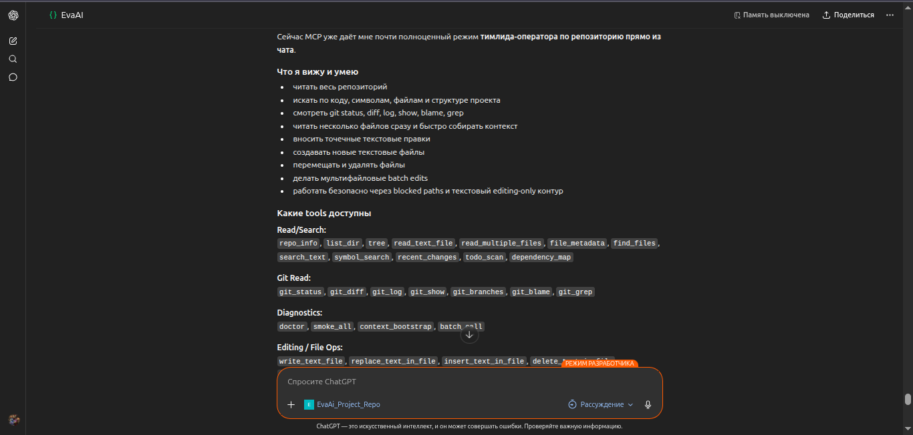

# ChatRepo MCP

[](python/)
[](go/)
[](contracts/tool-schemas/tools.json)
[](docs/INSTALL.md)
[](LICENSE)

Для постоянного запуска на локальном Linux ПК через OpenAI Secure MCP Tunnel,
подключения к ChatGPT и автозапуска после reboot есть
[полный runbook на английском](docs/OPENAI_SECURE_TUNNEL_RUNBOOK.md).

MCP-сервер, который превращает **любую папку или репозиторий** в рабочую среду для автономного кодинг-агента внутри ChatGPT. Пользователь выбирает Python-пакет или самостоятельный Go-бинарник; обе версии используют единый каталог из 96 инструментов. Каждый тул публикует канонические входную и additive-выходную схемы, поэтому MCP-клиенты получают типизированный structured result без потери прежнего JSON-текста. `ENABLE_PTY=true` теперь является дефолтом: на POSIX достаточно включить `ACCESS_MODE=full`, чтобы получить все 96 инструментов; safe-режим публикует 90 без PTY.

[Русская версия](README_RU.md) | [English](README.md)

* * *

## Скриншоты

Добавьте скриншот в `docs/assets/`:

- `docs/assets/chatgpt-repo-mcp-overview-ru.png` — обзор ChatGPT с подключённым ChatRepo MCP

После добавления файла эта ссылка отрендерится на GitHub:



* * *

## Что это

ChatRepo MCP — это удалённый [MCP](https://modelcontextprotocol.io)-сервер, который вы один раз запускаете (локально, на VPS, или на своём домашнем ПК через туннель) и подключаете к Developer Mode коннектору ChatGPT. Он даёт модели практичный набор возможностей уровня современного кодинг-агента над рабочей областью по вашему выбору: просмотр и поиск по файлам, чтение git-истории, аккуратные текстовые правки с dry-run превью и проверкой хэша, запуск команд вашего проекта (тесты, линтеры, сборка) через bash, полный git-workflow (ветки, stash, fetch/pull/push, merge, worktree), создание и управление GitHub pull request'ами и CI-запусками через `gh`, а также одноразовую диагностику кода и символьный индекс для навигации. Сервер **не привязан ни к какому конкретному проекту, языку или стеку** — Go, Python, Node/TypeScript, Rust или их смесь в одной polyrepo-папке работают одинаково хорошо, потому что сервер автоматически определяет, с чем имеет дело, вместо того чтобы зашивать команды одного проекта в код.

* * *

## Быстрый старт

### 1. Внешние зависимости

Обязательно нужны на машине, где запускается сервер:

- **Python 3.11+** для Python-версии либо готовый **Go-бинарник**
- **git**
- **[ripgrep](https://github.com/BurntSushi/ripgrep)** (бинарь `rg`) — используется тулами поиска
- **bash** — встроен в Linux/macOS; для нативного Windows Go-бинарника нужен Git Bash

Опционально, включают дополнительные группы тулов (при отсутствии сервер не падает — тул вернёт `missing_tools`/`install_hint`; на запуск сервера это не влияет):

- **[GitHub CLI](https://cli.github.com/) (`gh`)**, авторизованный (`gh auth login`) — для тулов `gh_*` (pull request'ы / CI)
- **[universal-ctags](https://github.com/universal-ctags/ctags)** (`ctags`) — для точного `symbol_definition` / `document_symbols` / `workspace_symbols`; без него эти тулы работают через regex-эвристику
- Диагностические тулы по вашему стеку, например `pyright` или `ruff` (Python), `go vet` (Go, идёт вместе с тулчейном Go), `tsc` через `npx` (TypeScript) — используются `code_diagnostics`

### 2. Установите одну реализацию

Python-пакет:

```bash
git clone <url-этого-репозитория>.git chatrepo-mcp
cd chatrepo-mcp

python3 -m venv .venv
source .venv/bin/activate
pip install -U pip
pip install -e ./python
```

Go из исходников (готовый release-архив предоставляет ту же команду `chatrepo-mcp`):

```bash
make build
```

Готовые бинарники, checksum и особенности ОС описаны в [инструкции по установке](docs/INSTALL.md).

### 3. Наведите сервер на свою папку

```bash
cp .env.example .env
```

Откройте `.env` и укажите `PROJECT_ROOT` — абсолютный путь к тому, с чем должен работать агент:

```env
PROJECT_ROOT=/home/you/code/my-project
```

### 4. Запуск

Python:

```bash
python -m chatrepo_mcp
```

Go:

```bash
./bin/chatrepo-mcp
```

MCP endpoint теперь доступен по адресу:

```text
http://127.0.0.1:8000/mcp
```

Подключите ChatGPT — см. раздел [Подключение к ChatGPT](#подключение-к-chatgpt) ниже или подробный гайд [`docs/CONNECT_CHATGPT.md`](docs/CONNECT_CHATGPT.md).

* * *

## Как навести сервер на свою папку

`PROJECT_ROOT` — единственное, что обязательно нужно задать, и это может быть:

- **Один репозиторий** — `PROJECT_ROOT=/home/you/code/my-api` (обычная git-репа, любой стек).
- **Polyrepo-workspace** — родительская папка с несколькими независимыми git-репозиториями внутри, например:

  ```text
  /home/you/code/platform/
  ├── billing-service/     (Go, свой .git)
  ├── web-frontend/        (Node/TypeScript, свой .git)
  ├── data-pipeline/       (Python, свой .git)
  └── infra/               (без git, просто конфиги)
  ```

  Задайте `PROJECT_ROOT=/home/you/code/platform` и вызовите тул `list_repos` — он сканирует вниз на `WORKSPACE_SCAN_DEPTH` уровней (по умолчанию 2) и возвращает все найденные репозитории с их стеком, веткой, состоянием (dirty/clean) и таргетами Makefile, если есть. Все git-тулы и все командные/пресет-тулы принимают опциональный параметр `repo="billing-service"` (или `cwd`), чтобы указать конкретный под-репозиторий.
- **Обычная папка без git** — тулы чтения/поиска/редактирования всё равно работают; git-специфичные тулы просто сообщат, что репозитория нет, вместо ошибки.

`list_repos` — естественная первая команда агента в новом workspace: это точка входа для discovery.

* * *

## Периметр (и как выйти за его пределы)

По умолчанию агент живёт строго внутри `PROJECT_ROOT`: может свободно `cd`/читать/писать/запускать команды в любой подпапке, но никогда выше или вне корня. За ширину периметра отвечают три настройки:

| Настройка | По умолчанию | Эффект |
|---|---|---|
| `PROJECT_ROOT` | *(обязательна)* | Корень workspace. Все относительные пути агента резолвятся относительно него. |
| `WORKSPACE_ROOTS` | *(пусто)* | Список через запятую **дополнительных** абсолютных папок, доступных наравне с `PROJECT_ROOT` — например, общая библиотека, которая лежит вне основного проекта. |
| `FILESYSTEM_UNRESTRICTED` | `false` | Если `true` — периметр снимается полностью: агент может читать/писать/запускать команды где угодно на машине, куда дотягивается процесс сервера. |

Структурные файловые/edit/index-тулы сохраняют блокировку `SECRET_GLOBS`, пока одновременно не заданы `ACCESS_MODE=full` и `ALLOW_SECRET_ACCESS=true`. Сырой shell в full-режиме намеренно не ограничен и может обращаться ко всему, что разрешено системному пользователю сервера.

Пример: дать агенту доступ ещё к одной папке рядом с основным проектом:

```env
PROJECT_ROOT=/home/you/code/my-api
WORKSPACE_ROOTS=/home/you/code/shared-protos
```

* * *

## Режим доступа и политика команд

`ACCESS_MODE=safe` — дефолт: ограниченный файловый периметр, allowlist команд, preview правок, stale-hash и внутренние подтверждения. `ACCESS_MODE=full` — явный режим доверенной машины: unrestricted shell/filesystem, реальные записи по умолчанию, move/delete и отсутствие внутренних запросов `confirmed`. `ALLOW_SECRET_ACCESS`, `ALLOW_FORCE_PUSH` и `ALLOW_HARD_RESET` остаются отдельными предохранителями структурных тулов.

`run_command` (и всё, что на нём построено: `run_test_preset`, `run_quality_gate`, фоновые jobs) — это настоящий shell `bash -lc`, под контролем `COMMAND_POLICY_MODE`:

| Режим | Поведение | Когда использовать |
|---|---|---|
| `allowlist` | Самый строгий. Разрешён только небольшой встроенный список безопасных команд (плюс то, что вы добавите через `.chatrepo/mcp.yml`). Shell-операторы (`&&`, `\|`, `;`, ...) отклоняются сразу. | Публичный/шаренный деплой, где нужен жёсткий потолок того, что может запуститься. |
| `guarded` | Полноценный bash, но `DESTRUCTIVE_WORDS` требуют `confirmed=true`, а `DENIED_WORDS` блокируются. | Промежуточная политика safe-режима. |
| `unrestricted` | Нет проверок command-policy; принудительно включается через `ACCESS_MODE=full`. | Полностью доверенная машина/учётка. |

В safe-режиме сырой `git push` блокируется и направляется через аудируемый `git_push`. Full-режим намеренно даёт сырой bash, поэтому raw push и другие shell-операции доступны; реальной границей становятся права отдельного системного пользователя и права репозитория.

**Важно:** четыре уровня разрешений действий в ChatGPT — отдельный клиентский слой. Чтобы веб не спрашивал, выберите **«Разрешить все действия»** для приложения. Сервер сохраняет честные MCP-аннотации; `ACCESS_MODE=full` убирает только серверные preview/confirmation gates.

* * *

## Автодетект стека и тестовые пресеты

Вместо того чтобы зашивать `npm test` или `pytest` под один проект, сервер смотрит, что реально лежит в папке, и резолвит нужную команду:

- `go.mod` → Go (`go test ./...`, `go vet ./...`, `go build ./...`, `gofmt -l .`)
- `pyproject.toml` / `setup.py` / `requirements.txt` / `Pipfile` → Python (`pytest -x -q`, `ruff check .`, `mypy .`, `ruff format --check .`)
- `package.json` (+ `tsconfig.json`) → Node/TypeScript (`npm test`, `npm run lint --if-present`, `npx tsc --noEmit`, `npm run build --if-present`)
- `Cargo.toml` → Rust (`cargo test`, `cargo clippy`, `cargo build`, `cargo fmt --check`)
- Таргет Makefile с подходящим именем (`test`, `lint`, `typecheck`, `format`, `build`) всегда побеждает дефолт по стеку, так как обычно инкапсулирует специфичные для проекта флаги.

Вызовите `run_test_preset("test")` в корне workspace или `run_test_preset("test", cwd="billing-service")` (эквивалентно составной форме `run_test_preset("billing-service:test")`) для конкретного под-репозитория в polyrepo. Используйте `list_test_presets` (опционально с `path=`), чтобы увидеть доступные действия и в какую команду каждое резолвится, прежде чем запускать.

* * *

## Группы тулов

Обе реализации используют каталог из 96 тулов. Safe-режим регистрирует 90, а full-режим на Linux/macOS — все 96, поскольку PTY включён по умолчанию. `doctor` показывает реальное число, effective PATH, версии toolchain и feature capabilities.

- **Чтение / поиск** — `repo_info`, `list_dir`, `tree`, `read_text_file`, `read_multiple_files`, `file_metadata`, `find_files`, `search_text`, `symbol_search`, `recent_changes`, `todo_scan`, `dependency_map`, `list_repos`. `search_text` по умолчанию работает в ограниченном режиме `quick`; `mode=exhaustive` запускает долговечный фоновый поиск, который опрашивается и отменяется через существующие job-инструменты.
- **Git (только чтение)** — `git_status`, `git_diff`, `git_log`, `git_show`, `git_branches`, `git_blame`, `git_grep` — все принимают опциональный `repo=` для polyrepo-workspace.
- **Редактирование** — `write_text_file`, `replace_text_in_file`, `insert_text_in_file`, `delete_text_in_file`, `create_text_file`, `move_path`, `delete_path`, `ensure_directory`, `batch_edit_files`, `apply_change_set`, `replace_lines`, `insert_before_line` / `insert_after_line`, `insert_before_heading` / `insert_after_heading`, `append_to_file`, `apply_patch`. Если `dry_run` не передан, safe делает preview, а full применяет; явный `dry_run=true` всегда оставляет preview.
- **Команды / тесты / jobs** — `run_command`, `run_commands`, `run_test_preset`, `list_test_presets`, `run_quality_gate`, `quality_gate_and_commit`, `scan_new_policy_violations`, `command_policy_check`, `start_command_job` / `list_command_jobs` / `get_command_job` / `get_job_status` / `get_command_log` / `summarize_command_log` / `cancel_command_job`, `read_artifact`, `git_worktree_guard`, `git_commit`.
- **Persistent terminal** (условно) — `start_terminal_session`, `read_terminal_session`, `write_terminal_session`, `resize_terminal_session`, `close_terminal_session`, `list_terminal_sessions`.
- **Git-workflow** — `git_switch_branch`, `git_create_branch`, `git_add`, `git_restore`, `git_stash`, `git_fetch`, `git_pull`, `git_push`, `git_merge`, `git_revert`, `git_reset`, `git_worktree_add` / `prepare_task_worktree` / `git_worktree_list` / `git_worktree_remove`. Safe делает preview/confirmation, full выполняет без внутренних вопросов. Структурные force push и hard reset всё равно требуют `ALLOW_FORCE_PUSH=true` / `ALLOW_HARD_RESET=true`.
- **GitHub** (нужен установленный и авторизованный `gh`) — `gh_status`, `gh_pr_create`, `gh_pr_list`, `gh_pr_view`, `gh_pr_comment`, `gh_pr_merge`, `gh_checks`, `gh_run_view`, `gh_run_rerun`, `gh_issue_list`, `gh_issue_view`.
- **Диагностика и символы** — `code_diagnostics` (запускает `go vet` / `pyright` (или `ruff`) / `tsc --noEmit` в зависимости от определённого стека), `symbol_definition`, `document_symbols`, `workspace_symbols` (через `ctags`, если установлен, иначе regex-эвристика — всегда с пометкой `engine`).
- **Самопроверка** — `doctor`, `smoke_all`, `context_bootstrap`, `batch_call`.

`batch_call` по умолчанию параллельно выполняет безопасные read/preview-вызовы (`max_concurrency=4`) и сохраняет порядок результатов; при необходимости задайте `execution="sequential"`. Worker concurrency не зависит от лимита тяжёлых операций: каждый тяжёлый дочерний tool отдельно получает общий lease и при заполненной capacity сразу возвращает `resource_busy`. Одинаковые фоновые test presets автоматически подключаются к уже запущенному job. PTY — сырой shell доверенной машины: он появляется только в full-режиме и при необходимости явно отключается через `ENABLE_PTY=false`.

Потенциально большие выводы проходят потоковую редакцию секретов до сохранения в памяти. Ответы command, Git и GitHub по умолчанию возвращают head/tail preview размером 64 KiB (`DEFAULT_INLINE_OUTPUT_BYTES`); hard ceilings и полный artifact при этом не уменьшаются. Когда полный отредактированный вывод сохранён долговечно, результат содержит готовый `continuation` для `read_artifact`. Его курсор непрозрачен: передавайте его обратно без изменений до `eof=true`. Артефакты автоматически истекают и ограничиваются квотами одного артефакта, общего хранилища и резервом свободного места.

* * *

## Настройка под свой стек через `.chatrepo/mcp.yml`

Положите файл `.chatrepo/mcp.yml` в корень целевой папки (или любого под-репо в polyrepo), чтобы расширить дефолты без изменения самого сервера:

```yaml
presets:
  # Именованный пресет с явной командой; подхватывается run_test_preset("integration")
  integration:
    command: "make integration-test"
    parser: auto
    cwd: services/api          # опционально: привязать пресет к конкретному под-репо

quality_rules:
  - no_secret_like_literals
  - no_new_console_log

mission:
  current: docs/CURRENT_TASK.md

allowed_commands:
  # Учитывается только в COMMAND_POLICY_MODE=allowlist
  - "make lint"
  - command: "npx vitest run"
    allow_suffix: true

confirmation_commands:
  - "docker compose"
```

- `presets` — именованные команды, резолвятся через `run_test_preset`/`list_test_presets`; для одного и того же имени действия они побеждают автодетект/Makefile-пресеты.
- `quality_rules` — id правил, используемые `scan_new_policy_violations`/`run_quality_gate` при сканировании только новых строк diff'а (secret-like литералы, `console.log`, `: any`, `print(...)` и т.д. — полный список см. в `workflows.RULE_PATTERNS`).
- `mission` — опциональные контекстные файлы, которые ищут `context_bootstrap`/`doctor` (все опциональны; отсутствующие файлы просто помечаются, а не считаются ошибкой).
- `allowed_commands` / `confirmation_commands` — расширяют встроенный список команд режима `allowlist`.
- Полный вложенный YAML требует `pip install pyyaml` (опциональная зависимость); без неё встроенный минимальный парсер понимает простые двухуровневые структуры вроде примера выше.
- `COMMAND_SHELL_PRELUDE` (например, чтобы подключить `nvm`/`pyenv`/virtualenv перед запуском команд) — это **переменная окружения** сервера, а не ключ `mcp.yml`; задаётся в `.env`.

* * *

## Подключение к ChatGPT

1. Для локального/приватного сервера создайте [OpenAI Secure MCP Tunnel](https://platform.openai.com/settings/organization/tunnels), выпустите runtime key на [странице API keys](https://platform.openai.com/settings/organization/api-keys) и запустите `tunnel-client` локально.
2. Откройте <https://chatgpt.com/plugins>, нажмите **+**, выберите **Tunnel** и свой туннель. При loopback-only MCP за туннелем используйте **No Authentication**.
3. Для публичного URL выберите **Server URL** и настройте OAuth или другой поддерживаемый ChatGPT способ аутентификации; не выставляйте full-agent анонимно.
4. Чтобы ChatGPT не спрашивал, выберите **«Разрешить все действия»**; независимо от этого на сервере задайте `ACCESS_MODE=full`.

Подробный гайд, включая первые промпты для проверки: [`docs/CONNECT_CHATGPT.md`](docs/CONNECT_CHATGPT.md).

* * *

## Безопасность

- **Доступ к секретам включается явно.** Для структурных тулов нужны `ACCESS_MODE=full` и `ALLOW_SECRET_ACCESS=true`; raw shell в full подчиняется правам ОС.
- **Вывод команд редактируется.** Токены, пароли, API-ключи, bearer-заголовки, приватные ключи и URL с учётными данными вырезаются из stdout/stderr команд перед возвратом и записью в лог.
- **Каждая команда аудируется.** `run_command`/`run_commands`/фоновые jobs/`git_push` дописывают структурированную JSON-строку (секреты вырезаны) в `COMMAND_AUDIT_LOG_PATH` (по умолчанию `~/.local/state/chatrepo-mcp/commands.log`).
- **Записи зависят от режима.** Safe сохраняет glob/hash/dry-run защиту; full применяет изменения сразу, если вызывающий явно не запросил preview.
- **Full означает настоящий shell.** Safe направляет push через структурный тул; full допускает raw shell и ограничен правами системного пользователя, под которым запущен сервис.
- **Аутентификация зависит от транспорта.** Secure MCP Tunnel использует отдельный runtime API key внутри `tunnel-client`, а loopback MCP может оставаться с `MCP_AUTH_MODE=none`. Публичному URL нужен OAuth или другой поддерживаемый ChatGPT слой. Static bearer предназначен для клиентов, умеющих отправлять заголовок напрямую.

* * *

## Где это полезно

Работает одинаково независимо от того, что лежит в папке:

- Онбординг в незнакомой кодовой базе — как в одном репо, так и в polyrepo
- Расследование багов между сервисами на разных языках
- Небольшой фикс от начала до конца: ветка → правка → тесты → commit → push → PR → проверка CI
- Ревью pull request'а и ответы на review-комментарии
- Обзор архитектуры/зависимостей и поиск TODO/FIXME

* * *

## Структура проекта

```text
chatrepo-mcp/
├── README.md
├── README_RU.md
├── .env.example
├── VERSION
├── Makefile
├── python/
│   ├── pyproject.toml
│   ├── src/chatrepo_mcp/
│   └── tests/
├── go/
│   ├── go.mod
│   ├── cmd/chatrepo-mcp/
│   └── internal/
├── contracts/
│   ├── tool-schemas/
│   └── acceptance/
├── docs/
│   ├── ARCHITECTURE.md
│   ├── DEPLOY_VPS.md
│   ├── CONNECT_CHATGPT.md
│   ├── EXPOSE_LOCAL_PC.md
│   └── VPS_LOCAL_RUNBOOK.md
├── deploy/
│   ├── caddy/
│   ├── nginx/
│   └── systemd/
└── scripts/
```

* * *

## Лицензия

MIT — см. [LICENSE](LICENSE)
